# Вывод рамочки с регистрами в DOSBox

По нажатию определенной клавиши выводится рамочка с актуальными значениями регистров DOSBox.

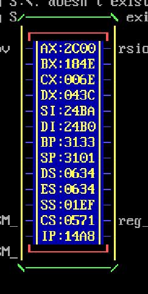

***Базовый вид рамки***

## Описание

### 1. Установка программы-резидента

Для того, чтобы рамочка выводилось необходимо сохранить код программы в память DOSа. Чтобы это сделать, запустите ***reg_frame.com*** (он находится в папке ***frame09***).

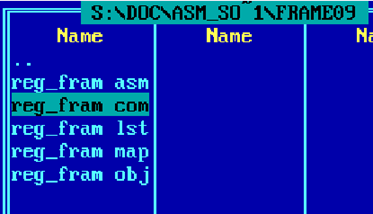

```cmd
> reg_frame.com
```

Чтобы проверить, что резидент установился, нажмите ***Alt-F5***. Вы увидите ***Memory info***. В одной из строк в столбике ***Program*** вы должны увидеть ***reg_fram.сom***. Если все сделано верно, в столбике ***Hooked vectors*** должны находиться ***08*** и ***09***.

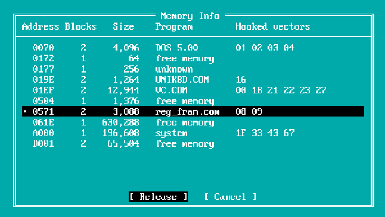

Поздравляю, резидент установлен. Теперь все 8-е (timer) и 9-е (keyboard) прерывания перехватываются программой-резидентом и предварительно обрабатываются.

Если вы хотите удалить резидента из памяти, то наведитесь в ***Memory Info*** на нужную строки и нажмите ***Release***.

### 2. Работа с рамочкой

Теперь при нажатии ***F11*** на экране появлятся рамка с актуальными значениями регистров (обновляются каждое прерывание таймера).

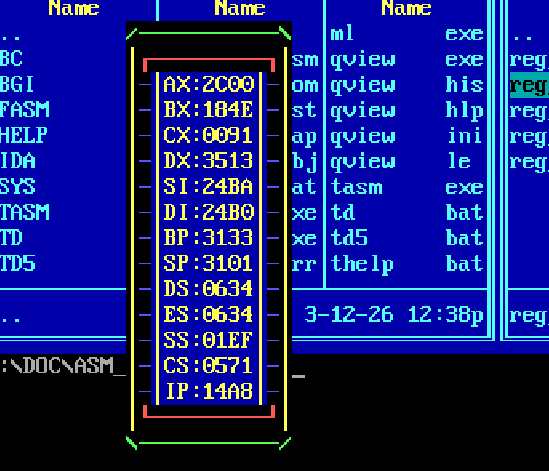

Чтобы рамочка исчезла, нажмите правый ***Shift***. Видеопамять под рамочкой будет иметь такой вид, какой она бы имела, если бы рамочки никогда не было.

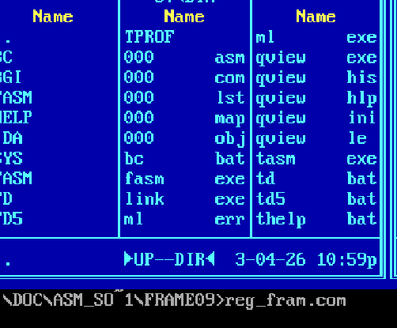

### 3. Перемещение рамочки

Если рамочка включена, то используя стрелки её можно двигать, при этом резидент полностью перехватывает нажатия стрелок и не пропускает их дальше, то есть при включенной рамочке стрелками можно только двигать рамочку.

Рассмотрим исходное расположение рамочки.

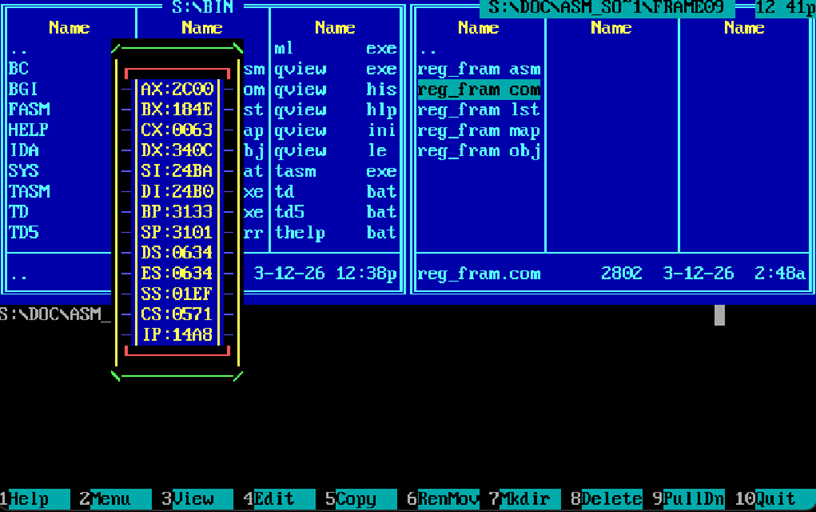

Нажав несколько раз стрелочку вправо.

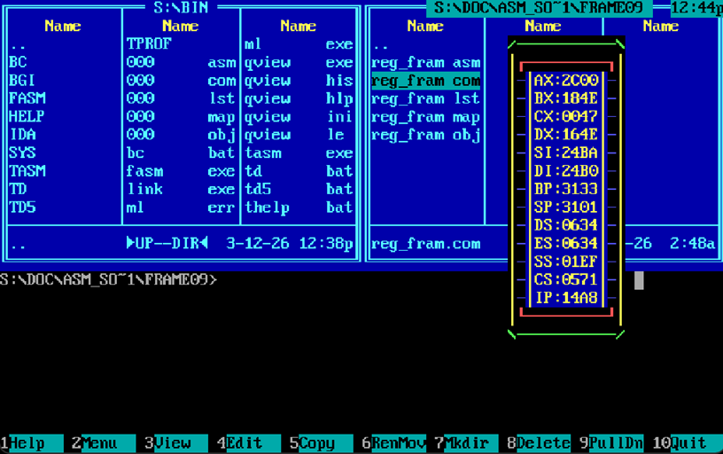

Теперь попробуем подвинуть её вниз.

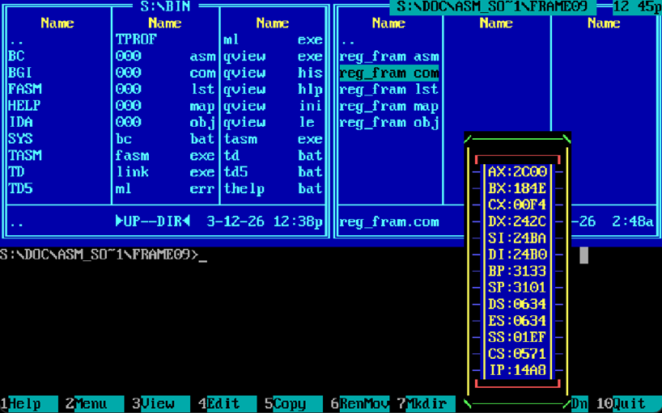

За пределы окна ***DOS*** рамочка выйти не может ни по одной из границ.

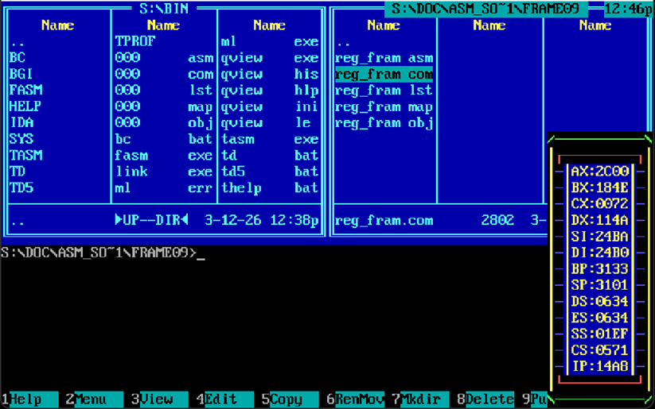

### 4. Изименения стиля рамочки

Существуют два способа изменить стиль рамочки.

#### 1) Задать стиль рамочки при запуске ***reg_fram.com***

Чтобы рамочка рисовалась в базовом стиле нужно запустить ***reg_fram.com*** с аргументом **0** или без аргументов совсем:

```cmd
> reg_fram.com 0
```
или
```cmd
> reg_fram.com
```

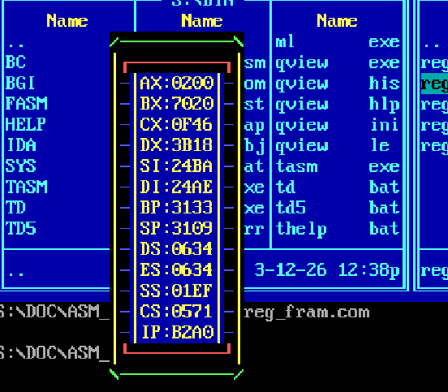


Чтобы вывести рамочку в некотором стиле, после ***reg_fram.com*** укажите индекс стиля, в котором вы бы хотели видеть рамочку:
```cmd
> reg_fram.com 1
```

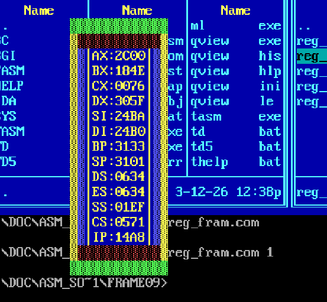


```cmd
> reg_fram.com 2
```

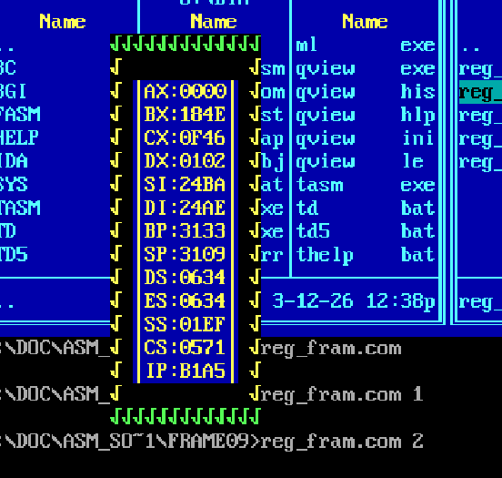

Если вы хотите увидеть регистры из широко открытой пасти крокодила, выбирайте 3-й стиль:
```cmd
> reg_fram.com 3
```
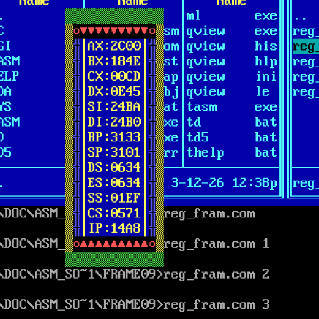

Всего у рамочки есть 4 заданных стиля. Поэтому, если задать индекс стиля больший 3-х, то рамочка будет составлена из символов, расположенных в памяти после таблицы стилей:

```cmd
> reg_frame.com 111
```

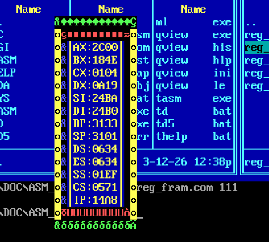

```cmd
> reg_frame.com 214
```

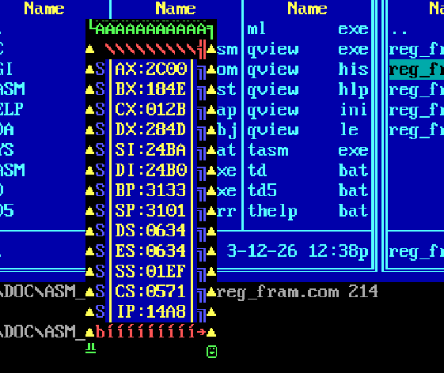

#### 2) Задать свой шрифт с помощью EVAFONT

Для этого перейдите в папку ***EVA***. В ней будут расположены файлы ***.fnt***, ***.com***, ***evafont.exe***. Чтобы сделать выбранный шрифт основным запустите ***.com***-файл. Так, один из доступных шрифтов:

```cmd
> wavy.com
```

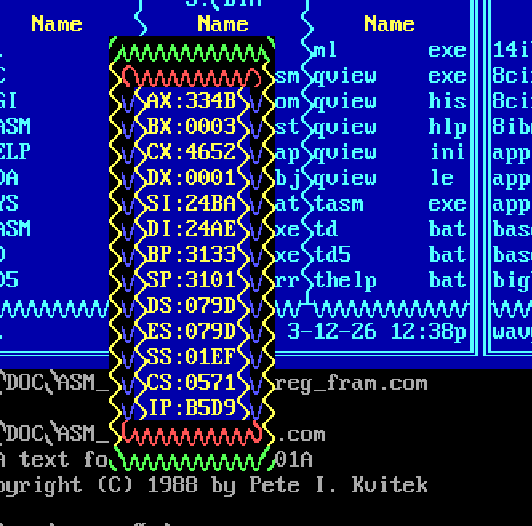

Для того, чтобы вернуть шрифт к обычному, запустите ***base.com***:

```cmd
> base.com
```

С помощью ***EVAFONT*** вы можете сделать свой шрифт. Для этого запустите ***evafont.exe***:

```cmd
> evafont.exe
```

В открывшемся окне вы увидите следующее:

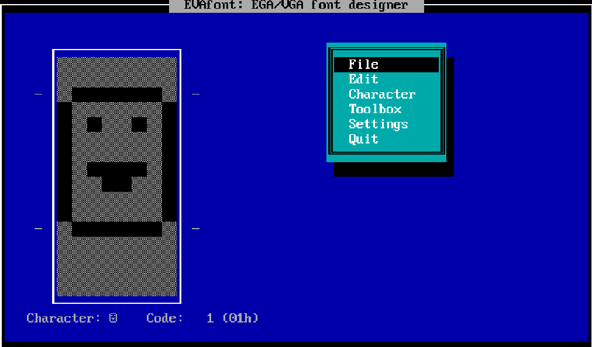

В панели ***File*** вы можете загрузить один из имеющихся стилей или сохранить свой. В панели ***Character -> Select*** выберите символ, который вы хотите изменить, а затем нажмите ***Edit*** и нарисуйте новый символ:

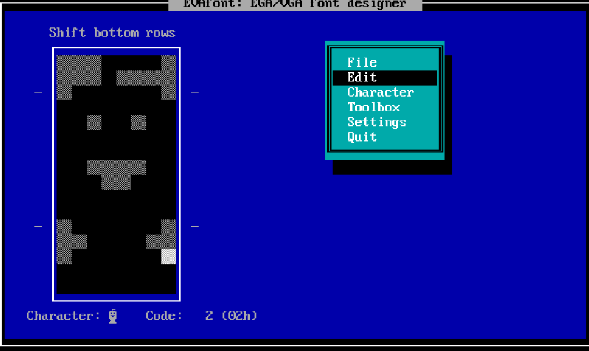

В панели ***Charaсter*** вы можете сразу задать нынешний шрифт как основной.

### 5. Проверка правильности работы

Чтобы увидеть рамочку нажмите ***F11***:

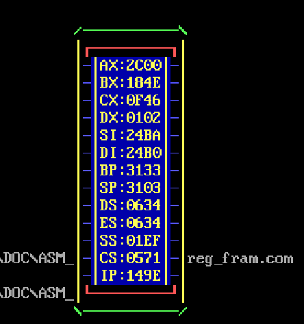


Чтобы проверить, что регистры выводятся правильно, запустим тестовую программу. Откройте папку ***09h*** и запустите файл ***test_dri.com***:

```cmd
> test_dri.com
```

После запуска вы должны увидеть следующие значения регистров (все регистры кроме ***AL*** и ***IP*** меняться не должны):

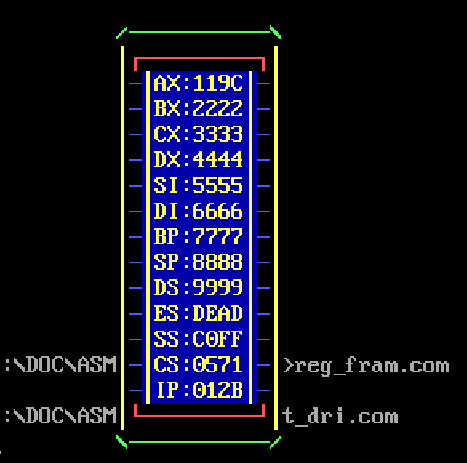

Чтобы завершить тестирование нажмите ***Esc*** и вы сможете увидеть, что регистры снова начали актуально обновляться:

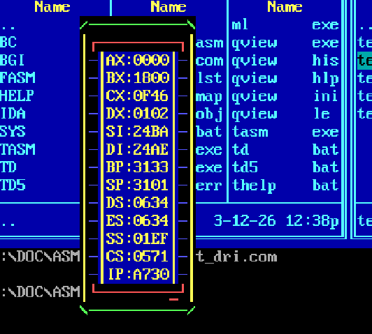

MIPT ⓒ Padalko Aleksandr
